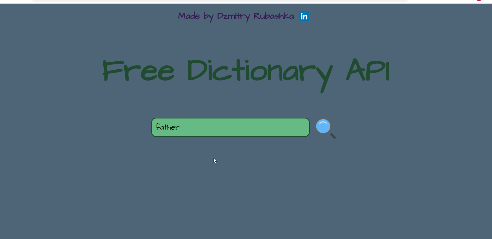

# Dictionary Application

## Dictionary is a simple application that displays information from API about the word entered in the search box (if the word is found).

> After you cloned the application to your computer, in the project directory run
> ### `npm install`
> to install all dependencies for the project.

> To start the project run
> ### `npm start`
> and use it in opened browser window with application.
>
> The page will reload if you make edits.\
> You will also see any errors in the console.